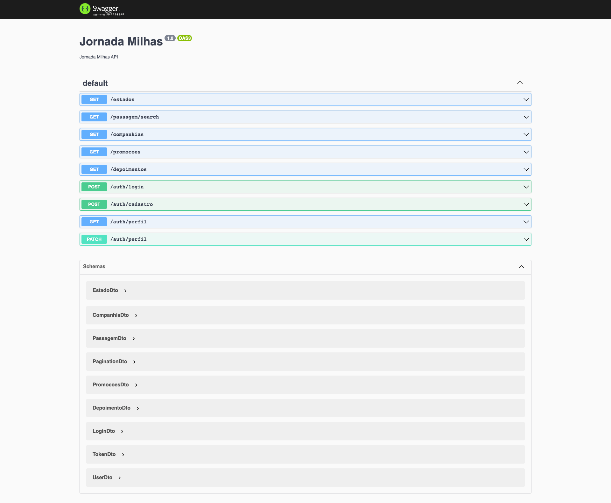
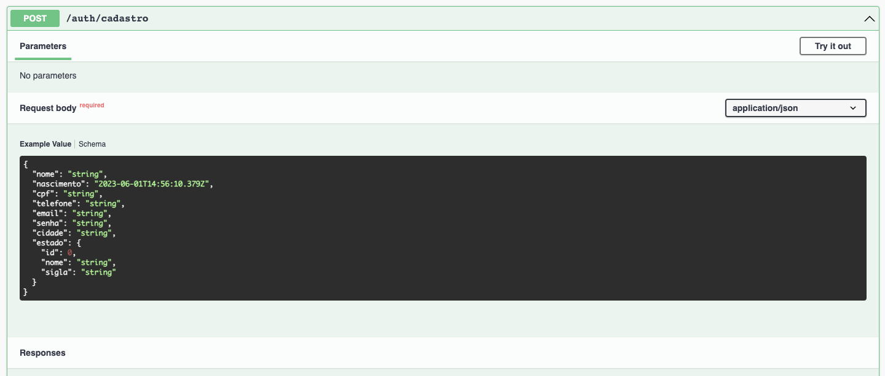
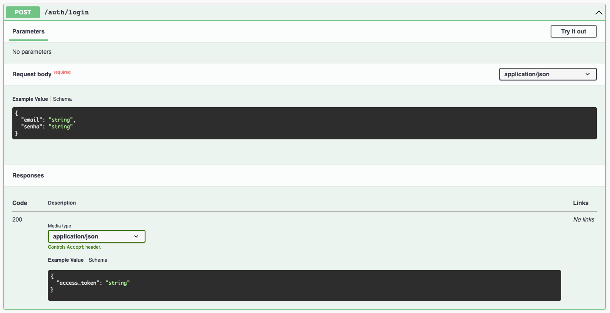

# Jornada Milhas

O Jornada Milhas é uma startup fictícia utilizada na formação [Angular](https://cursos.alura.com.br/). 
É um MVP que tá só começando e ainda tem muitas funcionalidades novas para serem desenvolvidas.

# Api em Nest

Esse é um protótipo da API pra permitir o desenvolvimento do frontend.


## 🛠️ Instalação

```bash
$ npm install
```

## 🛠️ Execução

Abra um terminal e execute o seguinte comando:

```bash
$ npm run start
```

Agora sim, deixe o terminal em execução está tudo pronto para o início do curso!

## 🛠️ Documentação

Com a aplicação em execução, abra o seu navegador e acesse [http://localhost:8080/api](http://localhost:8080/api) para ter acesso ao Swagger, a fonte de verdade sobre a nossa API e como ela funciona:




## Autenticação

Você pode se cadastrar utilizando o endpoint:



E se autenticar utilizando o endpoint:



E depois, basta adicionar o token ao header das requisições autenticadas:

```
Authorization: Bearer <ACCESS_TOKEN>
```

## 📚 Mais informações do curso

O Jornada é o projeto utilizado durante toda a formação, e essa API será utilizada em vários cursos diferentes :)